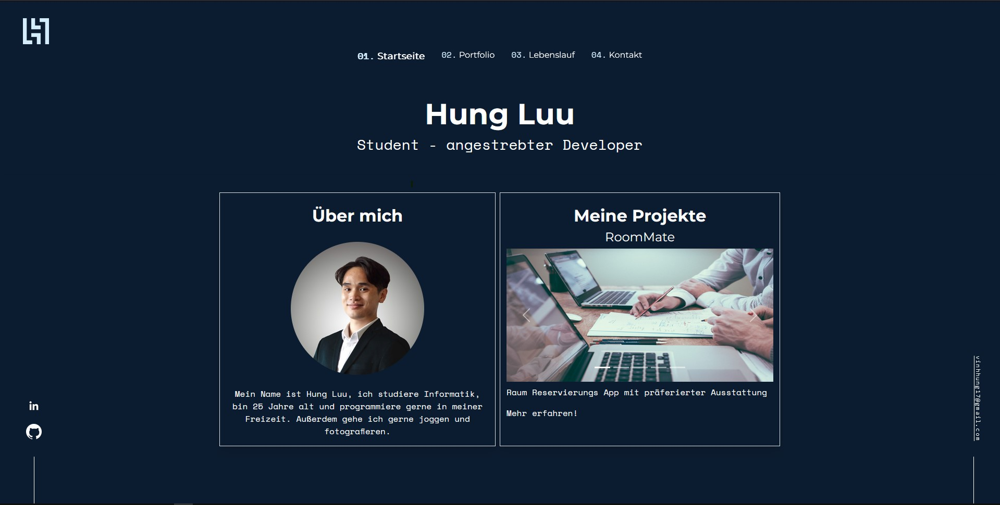
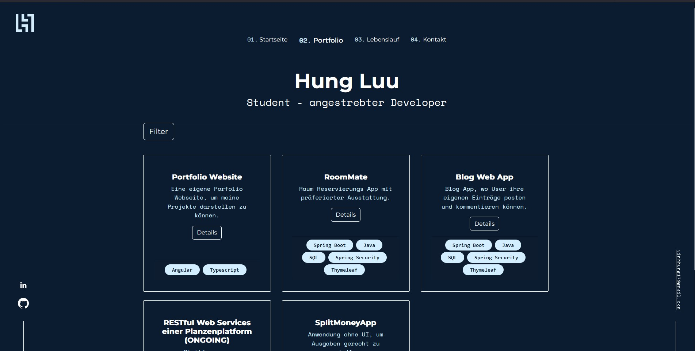
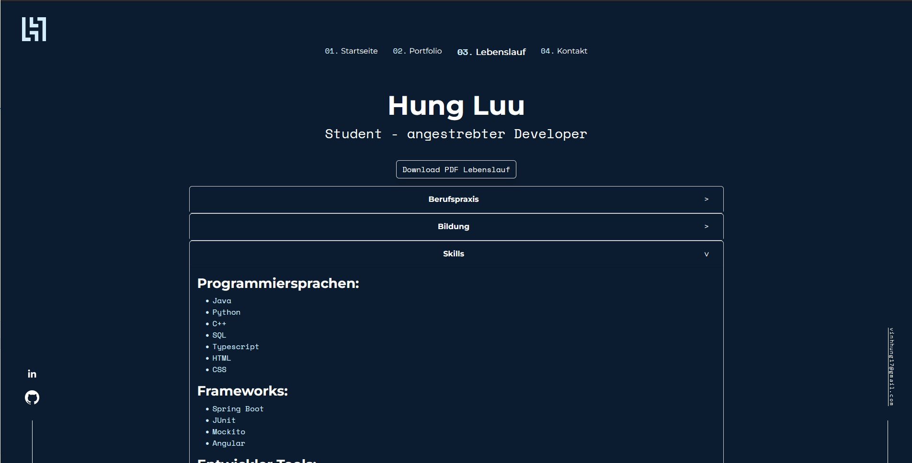
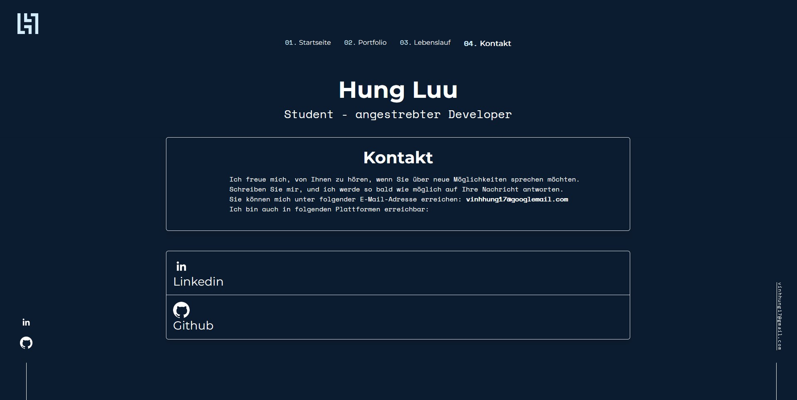

# My Portfolio

Willkommen auf meiner Portfolio-Website, entwickelt mit Angular und TypeScript.
<!-- Hier könnt ihr auf meine Portfolio-Seite zugreifen: https://hungfu123.github.io/portfolio-angular/ -->

## Home-Bereich

Der Home-Bereich gibt einen kurzen Überblick über meine Fähigkeiten und Schwerpunkte. Hier habe ich mit RouterLinks gerarbeitet.

## Projektübersicht

In der Projektübersicht findest du eine Liste meiner Projekte mit Tags für Sprachen und Frameworks. Nutze die Filterfunktion, um gezielt nach Projekten zu suchen.  Außerdem gibt es eine Detailübersicht dazu, wenn man auf Details klickt.

### Technologiestack
- Angular
- TypeScript
- Angular Router
- Angular Services
- CSS/SCSS
- Responsive Design

### Projekte

- Projekt A: 
  - Tags: Angular, TypeScript, CSS
- Projekt B:
  - Tags: Java, Spring Boot, Thymeleaf

## Lebenslauf-Bereich

Der Lebenslauf-Bereich zeigt meinen beruflichen Werdegang strukturiert an mit Accordions. Du kannst auch meinen Lebenslauf herunterladen.

## Kontakt-Bereich

## Setup

1. Klone das Repository: `git clone https://github.com/deinbenutzername/portfolio.git`
2. Navigiere in das Verzeichnis: `cd portfolio`
3. Installiere die Abhängigkeiten: `npm install`
4. Starte die Anwendung: `ng serve`
5. Öffne die Anwendung im Browser: [http://localhost:4200/](http://localhost:4200/)

